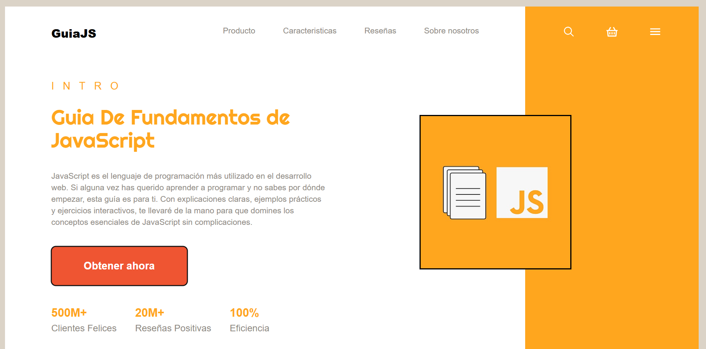

# 📘 GuiaJS - Landing Page

Bienvenido a **GuiaJS**, una landing page diseñada para promocionar y ofrecer una guía en PDF sobre los fundamentos de JavaScript. Esta aplicación está construida con **React** y estilizada con **Tailwind CSS**.

## 🌐 Demo
🔗 Puedes visitar la página en vivo aquí: [GuiaJS Landing Page](https://landingbuho.netlify.app/)

## 🚀 Tecnologías Utilizadas

- **React** ⚛️ - Biblioteca para construir interfaces de usuario.
- **Tailwind CSS** 🎨 - Framework de CSS para un diseño rápido y flexible.
- **Vite** ⚡ - Entorno de desarrollo ultrarrápido para aplicaciones React.

## 📥 Instalación y Uso

Si deseas ejecutar este proyecto en tu entorno local, sigue estos pasos:

1. Clona el repositorio:
   ```sh
   git clone https://github.com/MTJonathan/landingbuho.git
   ```
2. Accede al directorio del proyecto:
   ```sh
   cd landingbuho
   ```
3. Instala las dependencias:
   ```sh
   npm install
   ```
4. Inicia el servidor de desarrollo:
   ```sh
   npm run dev
   ```

## 📌 Características

✅ **Guía en PDF** – Descarga un recurso completo para aprender JavaScript.
✅ **Interfaz moderna** – Diseño atractivo y responsivo.
✅ **Carga rápida** – Optimización con Vite para un rendimiento óptimo.
✅ **Botón de acción** – Accede a la guía con un solo clic.

## 📷 Imagen Del Landing Page


